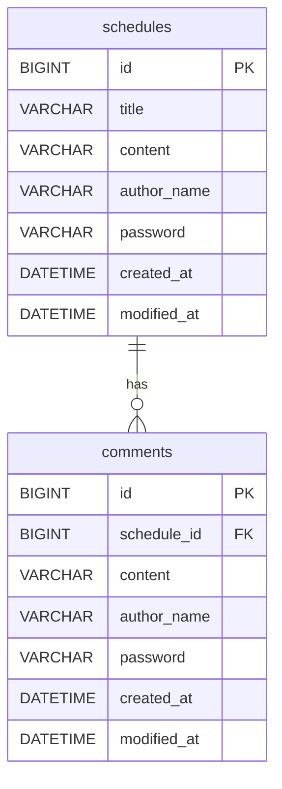

# 📚 일정 관리 앱 (Spring Schedule)

---

## 1. 프로젝트 소개
- 일정(Schedule) CRUD 구현
- 댓글(Comment) 작성
- 일정 단건 조회 시 댓글 포함 응답
- 입력값 검증
- Spring Boot + Spring Data JPA + MySQL 기반

---

## 2. 기술 스택
- Java 17
- Spring Boot
- Spring Web
- Spring Data JPA
- MySQL Driver
- Lombok
- Gradle

---

## 3. 패키지 구조
- `com.springschedule`
  - `schedule`
    - `controller`
    - `dto`
    - `entity`
    - `repository`
    - `service`
  - `comment`
    - `controller`
    - `dto`
    - `entity`
    - `repository`
    - `service`
  - `common`
    - `validation` (입력 검증 유틸)
    - `exception` (예외 처리)
    - `entity` (BaseEntity)
  - `config` (JPA Auditing 설정)
---

## 4. ERD
> 일정 1개 : 댓글 N개



## 5. API 명세

### 5.1 공통 정보
- Base URL: `http://localhost:8080`
- Content-Type: `application/json`
- 모든 응답에서 `password`는 포함하지 않는다.

### 5.2 공통 상태 코드

| 상태코드 | 이름         | 의미                         | 언제 발생하는가 |
|---------:|--------------|------------------------------|-----------|
| 200      | OK           | 요청 성공                    | 조회/수정 성공 |
| 201      | Created      | 생성 성공                    | 일정/댓글 생성 성공 |
| 204      | No Content   | 삭제 성공                    | 일정 삭제 성공 |
| 400      | Bad Request  | 잘못된 요청                  | 입력값 검증 실패, 비밀번호 불일치, 댓글 10개 초과 등 |
| 404      | Not Found    | 리소스 없음                  | 존재하지 않는 일정 조회/수정/삭제 시 |


### 5.3 공통 에러 응답

**400 Bad Request**
- `message`: "에러 메시지"

```json
{
  "message": "비었음. 작성해 주세요."
}
```

---

## 6. Schedule API

### 6.1 일정 생성
- `POST /schedules`

**상태 코드**
| 상태코드 | 의미 |
|---------:|------|
| 201      | 일정 생성 성공 |
| 400      | 입력값 검증 실패 |

**Request Body**
```json
{
  "title": "일정1",
  "content": "내용1",
  "authorName": "박현지",
  "password": "1234"
}
```

**Response (201 Created)**
```json
{
  "id": 1,
  "title": "일정1",
  "content": "내용1",
  "authorName": "박현지",
  "createdAt": "0000-00-00T00:00:00",
  "modifiedAt": "0000-00-00T00:00:00"
}
```

---

### 6.2 전체 일정 조회
- `GET /schedules`
- Query Param: `authorName`
- 정렬: `modifiedAt` 내림차순으로 갑니다

**상태 코드**
| 상태코드 | 의미 |
|---------:|------|
| 200      | 조회 성공 |

**예시 호출**
- `/schedules`
- `/schedules?authorName=박현지`

**Response (200 OK)**
```json
[
  {
    "id": 2,
    "title": "일정2",
    "content": "내용2",
    "authorName": "박현지",
    "createdAt": "0000-00-00T00:00:00",
    "modifiedAt": "0000-00-00T00:00:00"
  },
  {
    "id": 1,
    "title": "일정1",
    "content": "내용1",
    "authorName": "박현지",
    "createdAt": "0000-00-00T00:00:00",
    "modifiedAt": "0000-00-00T00:00:00"
  }
]
```

---

### 6.3 선택 일정 단건 조회 (댓글을 포함합니다)
- `GET /schedules/{scheduleId}`

**상태 코드**
| 상태코드 | 의미 |
|---------:|------|
| 200      | 조회 성공 |
| 404      | 일정이 없음 |

**Response (200 OK)**
```json
{
  "id": 1,
  "title": "일정1",
  "content": "내용1",
  "authorName": "박현지",
  "createdAt": "0000-00-00T00:00:00",
  "modifiedAt": "0000-00-00T00:00:00",
  "comments": [
    {
      "id": 1,
      "content": "제목이 성의 없게 일정1이 뭔가요",
      "authorName": "박현지",
      "createdAt": "0000-00-00T00:00:00",
      "modifiedAt": "0000-00-00T00:00:00"
    }
  ]
}
```
---

### 6.4 선택 일정 수정 (비밀번호가 필요힙니다)
- `PATCH /schedules/{scheduleId}`
- 수정 가능: `title`, `authorName`만 수정 가능
- 수정 완료 시 `modifiedAt`을 갱신함

**상태 코드**
| 상태코드 | 의미 |
|---------:|------|
| 200      | 수정 성공 |
| 400      | 비밀번호 불일치/입력값 검증 실패 |
| 404      | 일정이 없음 |

**Request Body**
```json
{
  "title": "일정1 수정",
  "authorName": "박현지",
  "password": "1234"
}
```

**Response (200 OK)**
```json
{
  "id": 1
  "title": "일정1 수정",
  "content": "내용1",
  "authorName": "박현지",
  "createdAt": "0000-00-00T00:00:00",
  "modifiedAt": "0000-00-00T00:00:00"
}
```

---

### 6.5 선택 일정 삭제 (비밀번호가 필요합니다)
- `DELETE /schedules/{scheduleId}`

**상태 코드**
| 상태코드 | 의미 |
|---------:|------|
| 204      | 삭제 성공 |
| 400      | 비밀번호 불일치 |
| 404      | 일정이 없음 |

**Request Body**
```json
{
  "password": "1234"
}
```

**Response (204 No Content)**

---

## 7. Comment API

### 7.1 댓글 생성
- `POST /schedules/{scheduleId}/comments`
- 조건: 한 일정에 댓글 최대 10개

**상태 코드**
| 상태코드 | 의미 |
|---------:|------|
| 201      | 댓글 생성 성공 |
| 400      | 입력값 검증 실패/댓글 10개 초과 |
| 404      | 일정이 없음 |

**Request Body**
```json
{
  "content": "제목이 성의 없게 일정1이 뭔가요",
  "authorName": "박현지",
  "password": "1234"
}
```

**Response (201 Created)**
```json
{
  "id": 1,
  "content": "제목이 성의 없게 일정1이 뭔가요",
  "authorName": "박현지",
  "createdAt": "0000-00-00T00:00:00",
  "modifiedAt": "0000-00-00T00:00:00"
}
```

**Response (400 Bad Request) - 댓글 10개 초과**
```json
{
  "message": "댓글은 일정 하나당 최대 10개까지 작성할 수 있어요. 지금 10개 다 씀."
}
```

---

## 8. 입력 검증 규칙

### Schedule
- `title`: 필수, 최대 30자
- `content`: 필수, 최대 200자
- `authorName`: 필수
- `password`: 필수

### Comment
- `content`: 필수, 최대 100자
- `authorName`: 필수
- `password`: 필수
- 댓글 개수 제한: 일정 1개당 최대 10개

---
### 블로그 : https://ggoongdeng.tistory.com/242
